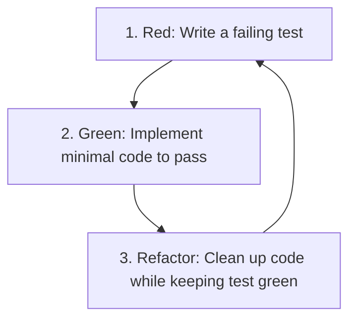

# TDD (Test-Driven Development) Guidelines

This document outlines the strict Test-Driven Development (TDD) workflow the agent must follow. All feature implementations and bug fixes must be driven by tests.

---

## 1. The Red-Green-Refactor Cycle

The agent must strictly follow the three phases of TDD when modifying code:

### A. Phase 1: Red (Write a failing test)
- Before writing any production code, write a test for the target functionality.
- Run the test suite and verify that the new test **fails** (typically with a compilation/reference error or assertion failure). This guarantees the test is actually evaluating the new requirement.

### B. Phase 2: Green (Make the test pass)
- Write the **minimum** amount of code required to make the failing test pass.
- Do not add extra features or write code that is not yet verified by tests.
- Run the test suite and ensure all tests pass (turn green).

### C. Phase 3: Refactor (Clean up the code)
- Refactor both the implementation code and the test code.
- Remove duplication, improve readability, extract constants, or split complex functions.
- Run the test suite after every small refactoring change to ensure the tests remain **green**.

---

## 2. Test File Naming & Location Conventions

Maintain the following conventions to keep testing organized:

- **Backend (server)**:
  - Test files should be placed inside a `__tests__` directory alongside the target code, or match the pattern `*.test.js` or `*.spec.js`.
  - Example: `server/src/controllers/__tests__/authController.test.js` for `server/src/controllers/authController.js`.
- **Frontend (client)**:
  - Use `*.test.jsx` or `*.spec.jsx` next to the component file.
  - Example: `client/src/components/Button.test.jsx` next to `client/src/components/Button.jsx`.

---

## 3. Preferred Test Frameworks

Unless specified otherwise by the user:

- **Backend (Node.js/Express)**:
  - Framework: **Jest** (or **Vitest**)
  - HTTP Testing: **Supertest** (for integration tests on Express routes without starting the HTTP server).
  - Mocks: Use Mocking utilities of Jest/Vitest for databases, external APIs, and services.
- **Frontend (React)**:
  - Runner: **Vitest** (fast, Vite-native)
  - Testing Library: **React Testing Library** (testing components from the user's perspective).
  - API Mocking: **MSW (Mock Service Worker)** to mock backend endpoints.
